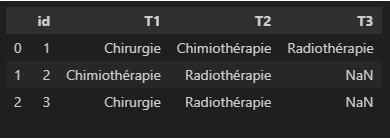

# Trajectory Clustering Analysis (TCA)

## 🚀 Description

TrajectoryClusteringAnalysis (TCA) is a Python package designed to analyze and visualize individual trajectories over time using sequence clustering techniques. While initially developed for modeling healthcare trajectories (e.g., treatment sequences for cancer patients), TCA is versatile and can be applied to a wide range of life course data such as employment histories, education paths, or any form of individual longitudinal states.


## 🔍 Main Features

- **Unidimensional Analysis:**
    - **Modeling Care Trajectories:** Representation of patients through chronological sequences of treatments.
- **Multidimensional Analysis:**
    - Tensor Decomposition using the [SWoTTeD model](https://hsebia.gitlabpages.inria.fr/swotted/) to identify and analyze complex, multi-event trajectories.
- **Flexible Distance Metrics:** Includes Hamming, Levenshtein, DTW, Optimal Matching (OM), and GAK.
- **Clustering Algorithms:** 
  - [Hierarchical clustering](https://en.wikipedia.org/wiki/Hierarchical_clustering) (CAH).
  - [K-Medoids](https://python-kmedoids.readthedocs.io/en/latest/index.html#) clustering (for robustness against noise):Clustering based on a precomputed distance matrix.
  - [K-Means](https://en.wikipedia.org/wiki/K-means_clustering) Clustering: Two methods available:
      - Clustering based on the frequency of states.
      - Clustering directly on the wide-format encoded sequences.
- **Visualization Tools:** Heatmaps, dendrograms, cluster plots, etc.
- **Notebook Examples:** Provided for quick experimentation.

## 📦 Installation

1. Clone the repository:
   ```bash
   git clone https://github.com/QuanTIMLab/TrajectoryClusteringAnalysis.git
   cd TrajectoryClusteringAnalysis
   ```

2. Create a virtual environment (optional but recommended):
   ```bash
   python -m venv venv
   source venv/bin/activate  # On Windows: venv\Scripts\activate
   ```

3. Install dependencies:
   ```bash
   pip install -r requirements.txt
   ```

4. Install the package:
   ```bash
   pip install .
   ```

## ⚙️ Basic Usage

```python
from trajectoryclusteringanalysis.tca import TCA

# Example data
trajectories = [
    ["Surgery", "Chemotherapy", "Radiotherapy"],
    ["Chemotherapy", "Radiotherapy"],
    ["Surgery", "Radiotherapy"]
]

# Preprocessing data
```

```python
# Initialization and clustering
# Example for DataFrame input (ensure df_wide_format is defined, e.g., from pivoted data)
model = tca(data=df_wide_format,
            index_col='id',
            time_col=None,  # Not used in unidimensional analysis
            event_col=None,  # Not used in unidimensional analysis
            alphabet=["Surgery", "Chemotherapy", "Radiotherapy"],
            states=["Surgery State", "Chemotherapy State", "Radiotherapy State"],
            mode='unidimensional')

# Compute distance matrix (e.g., Hamming or Optimal Matching)
distance_matrix = model.compute_distance_matrix(metric='hamming')
# OR with optimal matching and custom costs:
# custom_costs = {'Surgery:Chemotherapy': 1, 'Surgery:Radiotherapy': 2, 'Chemotherapy:Radiotherapy': 3}
# sub_matrix = model.compute_substitution_cost_matrix(method='custom', custom_costs=custom_costs)
# distance_matrix = model.compute_distance_matrix(metric='optimal_matching', substitution_cost_matrix=sub_matrix, indel_cost=1.5)

# Hierarchical Clustering (CAH)
linkage_matrix = model.hierarchical_clustering(distance_matrix)
model.plot_dendrogram(linkage_matrix)
# Visualization
model.plot_clustermap(model.data,linkage_matrix)
# Assign clusters
clusters = model.assign_clusters(linkage_matrix, num_clusters=4)
model.plot_cluster_heatmaps(model.data,clusters)
```

## 🔬 Applications
### TCA is suitable for analyzing sequential data in various domains, such as:

 - Healthcare: Patient treatment pathways, diagnosis sequences

 - Social Sciences: Employment trajectories, education paths

 - Marketing: Customer journey modeling

- Sociology/Demography: Life course studies

## 📁 Repository Structure

```
TrajectoryClusteringAnalysis/
├── data/                   # Example and demo datasets
├── Notebooks/               # Jupyter notebooks (examples)
├── src/
│   └── trajectoryclusteringanalysis/
│       ├── tca.py
│       ├── plotting.py
│       ├── utils.py
│       ├── logger.py
│       ├── images/                  # Visuals for documentation
│       ├── optimal_matching.pyx
│       ├── unidimensional/
│       └── multidimensional/
├── tests/                  # Unit tests
├── requirements.txt
├── setup.py
├── pyproject.toml
├── MANIFEST.in
├── LICENSE
└── README.md
```

## 🧪 Examples

Example notebooks are available in the `Notebooks` folder to illustrate different trajectory analyses.

## 🧪 Running Tests
To run the tests, use the following command:
```python
python -m unittest discover -s tests
```

## 🤝 Contributing

1. Fork the project
2. Create your feature branch (`git checkout -b feature/AmazingFeature`)
3. Commit your changes (`git commit -m 'Add some AmazingFeature'`)
4. Push to the branch (`git push origin feature/AmazingFeature`)
5. Open a Pull Request

## 📧 Contact

**Authors:** DIENG Ndiaga & GREVET Nicolas   
**Email:** ndiaga.dieng@univ-amu.fr
**Email:** nicolas.GREVET@univ-amu.fr

---

© 2024 - Trajectory Clustering Analysis (TCA). All rights reserved.
