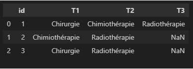

# Trajectory Clustering Analysis (TCA)

## Description

Trajectory Clustering Analysis (TCA) is a Python package for analyzing and visualizing temporal treatment sequences in a dataset.

## 🚀 Introduction

**Trajectory Clustering Analysis (TCA)** is a Python package designed for the analysis of care trajectories using clustering techniques. It allows modeling, grouping, and visualizing medical treatment sequences to identify patterns and similar patient profiles.

## 🔍 Main Features

- **Modeling Care Trajectories:** Representation of patients through chronological sequences of treatments.
- **Trajectory Clustering:** Utilization of dissimilarity measures (such as Hamming distance, OM, DTW) combined with hierarchical clustering methods (CAH).
- **Trajectory Visualization:** Graphical representation of trajectories for better interpretation of results.

## 📦 Installation

1. Clone the repository:
   ```bash
   git clone <repository_link>
   cd TrajectoryClusteringAnalysis
   ```

2. Create a virtual environment (optional but recommended):
   ```bash
   python -m venv venv
   source venv/bin/activate  # On Windows: venv\Scripts\activate
   ```

3. Install dependencies:
   ```bash
   pip install -r requirements.txt
   ```

4. Install the package:
   ```bash
   pip install .
   ```

## ⚙️ Basic Usage

```python
from TrajectoryClusteringAnalysis.TCA import TCA

# Example data
trajectories = [
    ["Surgery", "Chemotherapy", "Radiotherapy"],
    ["Chemotherapy", "Radiotherapy"],
    ["Surgery", "Radiotherapy"]
]

# Preprocessing data
```

```python
# Initialization and clustering
# Example for DataFrame input (ensure df_wide_format is defined, e.g., from pivoted data)
model = tca(data=df_wide_format,
            id='id',
            alphabet=["Surgery", "Chemotherapy", "Radiotherapy"],
            states=["Surgery State", "Chemotherapy State", "Radiotherapy State"])

# Compute distance matrix
# For Optimal Matching, you can specify a custom indel_cost:
#custom_costs = {'Surgery:Chemotherapy': 1, 'Surgery:Radiotherapy': 1, 'Chemotherapy:Radiotherapy': 3}
#sub_matrix=tca.compute_substitution_cost_matrix(method='custom', custom_costs=custom_costs)
# distance_matrix = model.compute_distance_matrix(metric='optimal_matching', 
#                                                 substitution_cost_matrix=sub_matrix,
#                                                 indel_cost=1.5) 
# If indel_cost is None (default for OM), it's calculated as max(sub_matrix)/2.
# For other metrics like 'hamming', 'levenshtein', 'dtw', 'gak':
distance_matrix = model.compute_distance_matrix(metric='hamming') # substitution_cost_matrix not needed for hamming
# Hierarchical Clustering (CAH)
linkage_matrix = model.hierarchical_clustering(distance_matrix)
model.plot_dendrogram(linkage_matrix)
# Visualization
model.plot_clustermap(linkage_matrix)
# Assign clusters
clusters = model.assign_clusters(linkage_matrix, num_clusters=4)
model.plot_cluster_heatmaps(clusters)
```

## 📊 Project Structure

```
TrajectoryClusteringAnalysis/
├── data/                   # Example or test data
├── Notebook/               # Analysis and demonstration notebooks
├── TrajectoryClusteringAnalysis/
│   ├── __init__.py         # Package initialization
│   ├── tca.py              # Trajectory clustering methods
│   ├── clustering.py       # Clustering algorithms
│   ├── plotting.py         # Plotting functions
│   └── utils.py            # Utility functions
├── tests/                  # Unit tests
│   ├── __init__.py
│   ├── test_tca.py
│   └── test_plotting.py
├── venv/                   # Virtual environment
├── setup.py                # Installation script
├── requirements.txt        # Dependencies
└── README.md               # Documentation
```

## 🧪 Examples

Example notebooks are available in the `Notebook` folder to illustrate different trajectory analyses.

## 🧪 Running Tests
To run the tests, use the following command:
```python
python -m unittest discover -s tests
```

## 🤝 Contributing

1. Fork the project
2. Create your feature branch (`git checkout -b feature/AmazingFeature`)
3. Commit your changes (`git commit -m 'Add some AmazingFeature'`)
4. Push to the branch (`git push origin feature/AmazingFeature`)
5. Open a Pull Request

## 📧 Contact

**Authors:** DIENG Ndiaga & GREVET Nicolas   
**Email:** ndiaga.dieng@univ-amu.fr
**Email:** nicolas.GREVET@univ-amu.fr

---

© 2024 - Trajectory Clustering Analysis (TCA). All rights reserved.
